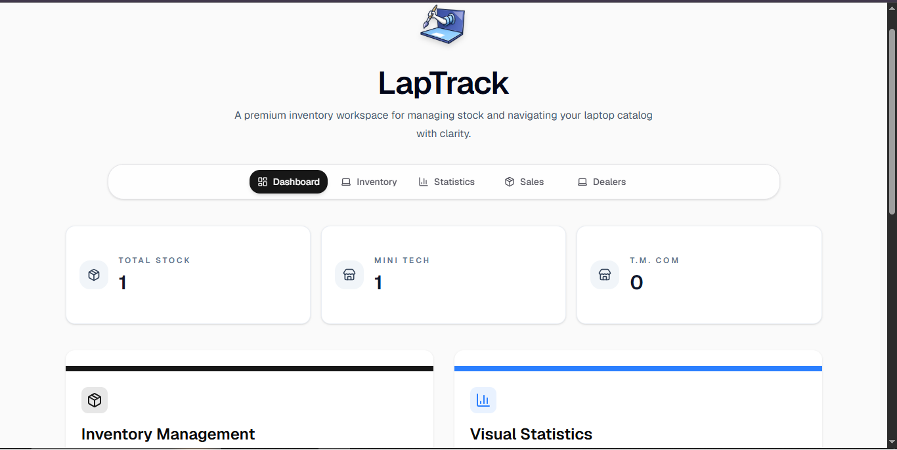
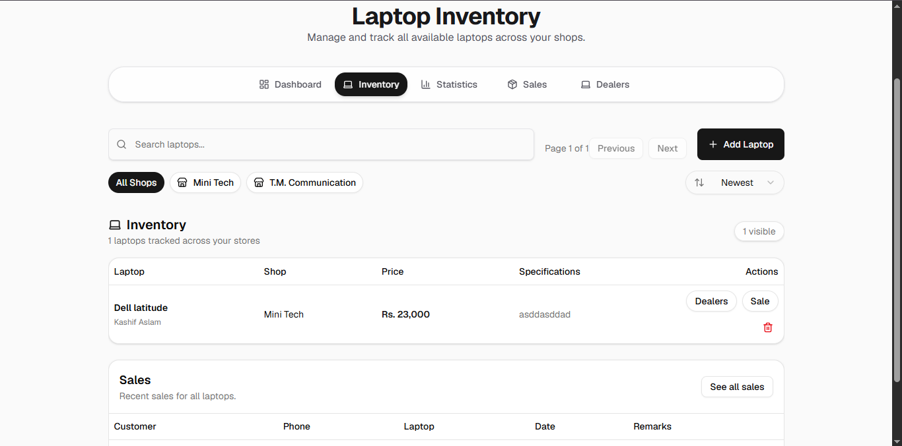
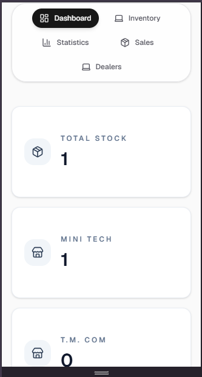

# LapTrack

A premium inventory workspace for managing stock and navigating your laptop catalog with clarity.

## Overview

LapTrack is a professional laptop inventory, asset tracking, and management platform designed for multi-location retail operations. It provides real-time inventory management, sales tracking, and comprehensive statistics across multiple shops.

## Features

- **Dashboard**: Overview of inventory status and key metrics
- **Inventory Management**: Track and manage laptop stock across multiple locations
- **Sales Tracking**: Monitor sales transactions and history
- **Statistics**: View detailed analytics and reports
- **Dealer Management**: Manage dealer information and relationships
- **Multi-location Support**: Support for "Mini Tech" and "T.M. Communication" shops
- **Responsive Design**: Fully optimized for desktop and mobile devices
- **PWA Ready**: Install as a progressive web app for offline access

## Screenshots

### Dashboard - Desktop


### Inventory - Desktop


### Mobile Experience


## Tech Stack

- **Framework**: [Next.js 15](https://nextjs.org) (App Router)
- **Database**: [Supabase](https://supabase.com) - PostgreSQL backend
- **Styling**: [Tailwind CSS](https://tailwindcss.com)
- **UI Components**: [shadcn/ui](https://ui.shadcn.com)
- **Icons**: [Lucide React](https://lucide.dev)
- **Form Management**: [React Hook Form](https://react-hook-form.com) + [Zod](https://zod.dev)
- **Hosting**: Ready for Vercel deployment

## Getting Started

### Prerequisites
- Node.js 18+ 
- npm or yarn
- Supabase account (for database)

### Installation

1. Clone the repository:
```bash
git clone <repository-url>
cd mngmnt-main
```

2. Install dependencies:
```bash
npm install
```

3. Set up environment variables:
Create a `.env.local` file with your Supabase credentials:
```env
NEXT_PUBLIC_SUPABASE_URL=your_supabase_url
NEXT_PUBLIC_SUPABASE_ANON_KEY=your_supabase_anon_key
```

4. Run the development server:
```bash
npm run dev
```

5. Open [http://localhost:3000](http://localhost:3000) in your browser

## Project Structure

```
src/
├── app/              # Next.js pages and routes
├── components/       # Reusable UI components
├── hooks/           # Custom React hooks
├── lib/             # Utilities and configurations
└── types/           # TypeScript interfaces
```

## Database

The application uses Supabase (PostgreSQL) for data persistence. The database schema includes tables for:
- Laptops (inventory items)
- Dealers (business partners)
- Sales transactions

See `database_schema.sql` for the complete schema.

## Development

### Build
```bash
npm run build
```

### Lint
```bash
npm run lint
```

### Type Check
```bash
npx tsc --noEmit
```

## Deployment

The easiest way to deploy is using [Vercel](https://vercel.com):

1. Push your repository to GitHub
2. Import the project in Vercel
3. Add environment variables
4. Deploy

Refer to the [Next.js deployment documentation](https://nextjs.org/docs/app/building-your-application/deploying) for more details.

## Browser Support

- Chrome/Edge (latest)
- Firefox (latest)
- Safari (latest)
- Mobile browsers (iOS Safari, Chrome Android)

## PWA Installation

LapTrack is installable as a Progressive Web App. Click the install button in your browser's address bar or use the app menu to install.

## License

This project is proprietary and confidential.

## Support

For issues and feature requests, please contact the development team.
